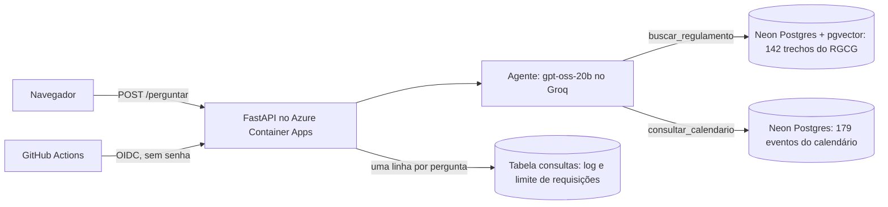

# Assistente do regulamento da UFG (RAG + agente)

Responde perguntas sobre o Regulamento Geral dos Cursos de Graduação (RGCG) e o Calendário Acadêmico 2026
da UFG, citando o artigo ou o evento de onde tirou cada informação. Quando os documentos não tratam do
assunto, diz isso em vez de inventar. Projeto de estudo com documentos públicos.

**Demo:** [ca-rag-ufg.kindpond-1fdbf9ec.northcentralus.azurecontainerapps.io](https://ca-rag-ufg.kindpond-1fdbf9ec.northcentralus.azurecontainerapps.io)
(página simples e API em `/docs`). Roda nos planos gratuitos do Azure, do Neon e do Groq, com limite de
50 perguntas por dia no total; a primeira pergunta depois de um tempo parado demora alguns segundos.

English version below.

## Como funciona



1. **Ingestão** (`scripts/ingerir.py`): baixa os dois PDFs da UFG e confere o SHA-256, extrai o texto com
   página, título, capítulo, seção e artigo, divide o regulamento em trechos e gera os embeddings com o
   multilingual-e5-small (ONNX quantizado em int8, na CPU, sem PyTorch). O calendário vira uma tabela com
   datas de início e fim, revisada à mão (`dados/calendario_2026.csv`).
2. **Agente** (`rag/agente.py`): o LLM recebe a pergunta e três ferramentas. `buscar_regulamento` faz a
   busca vetorial nos trechos (k=5); `consultar_calendario` faz busca híbrida nos eventos com filtro de
   datas; `responder` encerra com a resposta, a cobertura (total, parcial ou nenhuma) e os rótulos das
   fontes (T1, E2...). No máximo 4 chamadas ao LLM; na última ele é obrigado a responder. Erro de
   ferramenta volta para o modelo como mensagem, e citação de rótulo que ele não recebeu é descartada.
3. **API** (`api/`): FastAPI em container. Toda pergunta vira uma linha na tabela `consultas` (status,
   latência, tokens, ferramentas, erros), que também conta o limite de requisições.
4. **Nuvem**: Azure Container Apps com escala até zero, banco no Neon, imagem no GitHub Container Registry,
   infraestrutura em Bicep e deploy pelo GitHub Actions por OIDC.

## Avaliação

Dois conjuntos de perguntas com resposta e trecho anotados à mão:

- **Avaliação** (`dados/avaliacao.json`, 50 perguntas): 32 de regulamento, 8 de calendário, 2 mistas e 8
  sem resposta nos documentos. Usado para escolher as configurações.
- **Teste** (`dados/teste.json`, 10 perguntas escritas por mim, em linguagem de aluno): 7 de regulamento
  e 3 sem resposta. Rodado uma vez só, no fim, sem ajustar nada depois.

Correção e fidelidade às fontes são julgadas por um LLM maior (gpt-oss-120b), comparando com a resposta de
referência. Revisei à mão 10 decisões do juiz: concordei em 9 de 10 na correção e em 10 de 10 na
fidelidade (`resultados/revisao_juiz.csv`).

### Busca (sem LLM)

Acerto = um dos trechos devolvidos contém a frase anotada com a resposta. Resultados completos em
[resultados/busca.md](resultados/busca.md).

| Configuração | R@1 | R@5 | MRR@10 |
|---|---|---|---|
| Janela fixa de 800 caracteres | 35% | 68% | 0,51 |
| Por artigo, com título, capítulo e seção no embedding | 44% | 71% | 0,56 |
| **Por artigo, só com a seção (escolhida)** | **59%** | **88%** | **0,70** |
| Por artigo, sem contexto | 56% | 85% | 0,71 |
| Por artigo com seção, busca híbrida (vetor + full-text) | 62% | 79% | 0,71 |

**No conjunto de teste, a mesma configuração caiu para R@5 de 43%** (3 de 7). Ver as limitações.

### Respostas

| | RAG simples (etapa 4) | Agente (final) |
|---|---|---|
| Regulamento: correta (juiz) | 23/32 | 25/32 |
| Regulamento: correta ou parcial | 29/32 | 28/32 |
| Regulamento: fiel às fontes citadas | 28/30 | 25/30 |
| Calendário: correta | não consulta o calendário | 7/8 |
| Calendário: eventos certos recuperados | – | 12/12 |
| Mistas (regulamento + calendário): correta | – | 1/2 |
| Sem resposta: julgada correta | 8/8 | 8/8 |
| Tokens de entrada por pergunta | 1.263 | 2.811 |
| Latência p50 / p95 (chamadas ao LLM + busca) | 0,56 / 1,3 s | 0,97 / 1,9 s |
| Custo por 1.000 perguntas no plano pago do Groq | US$ 0,13 | US$ 0,26 |

Detalhes em [resultados/respostas.md](resultados/respostas.md) e [resultados/agente.md](resultados/agente.md).

**Agente no conjunto de teste** (10 perguntas, rodado uma vez em 30/09/2026; detalhes em
[resultados/agente_teste.md](resultados/agente_teste.md)):

| | Avaliação | Teste |
|---|---|---|
| Regulamento: trecho certo recuperado | 28/32 (88%) | 2/7 (29%) |
| Regulamento: correta (juiz) | 25/32 (78%) | 1/7 (14%) |
| Regulamento: correta ou parcial | 28/32 (88%) | 4/7 (57%) |
| Regulamento: fiel às fontes citadas | 25/30 (83%) | 3/6 (50%) |
| Sem resposta: julgada correta | 8/8 | 1/3 |

O teste confirma o que a busca já mostrava, e mostra um problema a mais: quando o trecho certo não vem,
o modelo nem sempre diz que não sabe. Em parte das respostas ele completa com regras que não estão nos
trechos citados (t03, t06, t10). Dez perguntas dão um número impreciso, mas a queda é grande demais para
ser ruído.

## Decisões

1. **Trecho = um artigo, com a seção junto no embedding.** Artigo é a unidade que a pessoa cita e que
   responde uma dúvida. A janela fixa de 800 caracteres corta artigos no meio: por artigo acertou 9
   perguntas que a janela errou, e a janela acertou 2 que o artigo errou. Pôr o caminho inteiro (título,
   capítulo, seção) no embedding piorou: só com a seção acertou 6 perguntas a mais e não perdeu nenhuma.
   O título longo do capítulo afasta o vetor do conteúdo do artigo.
2. **k = 5.** Com k=3 o trecho certo chegou ao LLM em 81% das perguntas; com k=5, em 91%. Custa 40% mais
   tokens de entrada, US$ 0,03 a mais por mil perguntas.
3. **Busca vetorial no regulamento, híbrida no calendário.** No regulamento a híbrida não ganhou em
   nenhuma pergunta e perdeu em 3. No calendário é o contrário: os eventos são frases curtas cheias de
   termos exatos ("2026/2", "trancamento"). Com a pergunta inteira, a busca por texto achou 2 de 15 eventos,
   a vetorial 7 e a híbrida 9; com termo curto e intervalo de datas, a híbrida achou os 15. No full-text,
   cada radical vira prefixo, porque o radicalizador do português separa "trancar" de "trancamento".
4. **"Não sei" decidido pelo LLM, não por limiar de similaridade.** A similaridade do melhor trecho nas
   perguntas sem resposta se mistura com a das que têm resposta (uma sem resposta teve 0,902, acima de
   várias com resposta). O LLM recebe os trechos e declara a cobertura.
5. **Citações presas ao schema.** Na primeira versão o modelo citou um número de trecho que não existia
   (provavelmente o número do artigo). Com saída estruturada strict e os rótulos como enum, isso deixou
   de ser possível. No agente, com tool calling, a checagem é feita no código.
6. **int8 em vez de fp32.** O modelo quantizado tem um quarto do tamanho e empatou na busca (1 pergunta
   de diferença).
7. **Busca exata no pgvector, sem índice aproximado.** Com 142 trechos a busca lê tudo em poucos
   milissegundos e nunca erra; HNSW só faria sentido com muito mais dados.
8. **Agente só onde ele se paga.** No regulamento, agente e RAG simples empatam dentro do ruído (o agente
   acertou 4 que o RAG errou e errou 2 que o RAG acertou), com 2,2 vezes os tokens. O ganho real é o
   calendário, que o RAG simples não consulta.
9. **Azure for Students.** Não pede cartão, dá US$ 100 de crédito e tem limite de gasto: quando o crédito
   acaba, a assinatura é desativada em vez de cobrar. Mesmo assim, o alerta de orçamento de US$ 1 por mês
   foi criado antes de qualquer recurso. Container Apps no plano de consumo porque a API já era um
   container e ele não cobra nada com zero réplicas. Imagem no GitHub Container Registry público, porque
   o registry do Azure cobra por mês. Região North Central US: a assinatura de estudante só aceita cinco
   regiões, e essa é a mais perto do Neon (Virgínia).
10. **Limite de requisições no Postgres.** Um contador em memória só vê a própria instância; contando
    na tabela de log, o limite vale para todas. O teto global de 50 perguntas por dia vem do limite do
    Groq que realmente pesa: 200 mil tokens por dia no gpt-oss-20b, cerca de 65 perguntas.

## Custo

- **Demo:** zero até aqui. Container Apps fica dentro da cota grátis mensal (180 mil vCPU-segundos,
  360 mil GiB-segundos, 2 milhões de requisições); Neon e Groq no plano grátis; Log Analytics com teto
  de 0,1 GB por dia.
- **Se o Groq fosse pago:** cerca de US$ 0,26 por mil perguntas no agente (tokens medidos na avaliação,
  preços de groq.com/pricing em 29/09/2026).

## Limitações

- **O conjunto de teste mostrou que a avaliação era otimista.** As perguntas de avaliação ficaram perto
  da linguagem do regulamento; as 10 de teste, em linguagem de aluno ("passar de uma matéria sem fazer
  prova"), derrubaram o R@5 de 88% para 43%. O embedding pequeno não liga "tragédia durante a prova" a
  "segunda chamada". Nas respostas do agente, só 1 de 7 perguntas de regulamento do teste saiu
  totalmente correta (4 de 7 contando as parciais).
- **Quando a busca falha, o modelo às vezes inventa.** No teste, metade das respostas com fonte trouxe
  afirmação que não está nos trechos citados, contra 17% na avaliação. Reescrever a pergunta antes da
  busca, usar um modelo de embedding maior e endurecer a regra de "não sei" são os próximos passos, e
  precisam de um conjunto de teste novo para serem medidos.
- **Conjuntos pequenos.** 50 + 10 perguntas, anotadas por uma pessoa. Diferenças de 1 ou 2 perguntas são
  ruído.
- **Perguntas que ligam as duas fontes ainda falham.** "Em caso excepcional, até quando posso cancelar
  uma disciplina?" exige ir do Art. 66 ao evento "nos termos do artigo 66" do calendário; o modelo
  respondeu o prazo normal.
- **Juiz LLM.** Concordei com ele em 9 de 10 decisões revisadas, mas a revisão cobriu só 10.
- **Cota compartilhada.** A demo e as avaliações usam a mesma cota diária do Groq; depois de uma rodada de
  avaliação completa, a demo responde 503 até a janela de 24 horas liberar.
- **Cold start.** Depois de uns 5 minutos parado, o app vai a zero réplicas; a primeira chamada levou
  6,5 s (container subindo e, provavelmente, o Neon acordando), as seguintes 0,64 s.
- **Contorno de um bug do provedor.** O gpt-oss às vezes escreve o nome da ferramenta com um sufixo do
  formato interno ("responder<|channel|>commentary"), e o Groq recusa a chamada. O cliente conserta só
  esse caso, em condições estritas, e conta quantas vezes: 3 nas 50 perguntas de avaliação.
- **Não testado:** carga e concorrência (a demo tem no máximo 1 réplica), autenticação (a API é pública,
  com limite por IP) e documentos além do RGCG de 2022 e do calendário de 2026.
- **Neon grátis:** projetos parados por 90 dias podem ser apagados; a ingestão recria o banco em cerca de
  1 minuto.

## Como rodar

Requisitos: Python 3.13, Docker e uma chave grátis do Groq.

```bash
python -m venv .venv
.venv/Scripts/activate                  # Linux/macOS: source .venv/bin/activate
pip install -r requirements-dev.txt
python scripts/gerar_env.py             # .env com senhas aleatórias; cole a GROQ_API_KEY nele
docker compose up -d --wait             # Postgres 17 + pgvector em 127.0.0.1:5433
python scripts/ingerir.py               # PDFs -> trechos -> embeddings -> banco (~1 min)
python scripts/perguntar.py "quantas vezes posso trancar e qual o prazo em 2027/1?" --agente
docker compose --profile api up -d --build   # a API em http://127.0.0.1:8000
pytest                                  # 73 testes sem banco
RODAR_INTEGRACAO=1 pytest -m integracao # 5 testes com o Postgres
```

Avaliações (gastam cota do Groq): `scripts/avaliar_busca.py`, `scripts/avaliar_respostas.py` e
`scripts/avaliar_agente.py`, todas com `--conjunto avaliacao|teste`. Log da API:
`python scripts/resumo_consultas.py`.

Nuvem: `scripts/preparar_neon.py` (banco), `scripts/deploy_azure.py orcamento` e depois
`scripts/deploy_azure.py infra`. A partir daí, cada push na main passa pelo CI e troca a imagem no Azure.

Nenhuma chave no repositório: o `.env` fica fora do Git (há um `.env.example`), os segredos da nuvem ficam
no Container App, e o GitHub Actions entra no Azure por OIDC com uma identidade que só pode alterar o app.

Feito com Claude Code, etapa por etapa, com os testes e as avaliações rodados em cada uma.

---

# UFG regulations assistant (RAG + agent)

Answers questions about UFG's undergraduate regulations (RGCG) and its 2026 academic calendar, citing the
article or calendar event behind each statement, and says so when the documents do not cover the question.
A study project built on public documents, in Portuguese.

**Demo:** [ca-rag-ufg.kindpond-1fdbf9ec.northcentralus.azurecontainerapps.io](https://ca-rag-ufg.kindpond-1fdbf9ec.northcentralus.azurecontainerapps.io)
(simple page, API at `/docs`). Runs on the free tiers of Azure, Neon and Groq, capped at 50 questions a
day overall.

## How it works

- **Ingestion:** downloads the two PDFs with a SHA-256 check, extracts text with page and section, splits
  the regulations into one chunk per article and embeds them with multilingual-e5-small (int8 ONNX, CPU
  only). The calendar becomes a table of dated events, reviewed by hand.
- **Agent:** the LLM (gpt-oss-20b on Groq) gets three tools: vector search over the regulations (k=5),
  hybrid search over calendar events with a date filter, and a final `responder` tool with coverage and
  source labels. At most 4 LLM calls, with the answer forced on the last one; tool errors go back to the
  model; citations of labels it never received are dropped.
- **API:** FastAPI in a container. Every question becomes a row in a `consultas` table (status, latency,
  tokens, tools, errors), which also drives rate limiting.
- **Cloud:** Azure Container Apps scaling to zero, Neon Postgres with pgvector, image on GitHub Container
  Registry, Bicep for infrastructure, GitHub Actions deploying through OIDC.

## Evaluation

Two hand-labeled question sets: 50 for development (32 regulations, 8 calendar, 2 mixed, 8 unanswerable)
and 10 held-out test questions I wrote in student language, run once at the end. An LLM judge
(gpt-oss-120b) grades correctness and faithfulness against a reference answer; I reviewed 10 of its
decisions and agreed on 9/10 for correctness and 10/10 for faithfulness.

- **Retrieval:** one chunk per article with only its section as context gave recall@5 of 88% (MRR 0.70),
  against 68% for fixed 800-character windows. **On the held-out test set the same setup dropped to 43%.**
- **Answers:** on the regulations the agent and the plain RAG pipeline tie within noise (25/32 vs 23/32
  correct), with 2.2x the input tokens. The real gain is the calendar: 7/8 correct and 12/12 expected
  events retrieved, which the plain pipeline cannot answer. Unanswerable questions: 8/8.
- **Agent on the held-out test set (10 questions, run once):** 1/7 regulation answers fully correct (4/7
  correct or partial), the right chunk retrieved for 2/7, 3/6 faithful to the cited sources and 1/3
  unanswerable questions handled correctly. When retrieval misses, the model sometimes fills the gap with
  rules that are not in the sources.
- **Cost:** about US$ 0.26 per thousand questions at Groq's paid prices; zero on the free tiers used here.

## Main decisions

One chunk per article (the unit people cite); section-only context, because the long chapter title hurt
retrieval (6 questions gained, none lost); k=5 over k=3 (91% vs 81% of questions with the right chunk in
context); vector search for the regulations but hybrid search for the calendar, whose short event lines
are full of exact terms; "I don't know" decided by the LLM, since the top-1 similarity of unanswerable
questions overlapped with answerable ones; citations constrained by a JSON schema enum after the model
cited a chunk that did not exist; rate limits counted in Postgres so they hold across cloud instances; a
global cap of 50 questions a day, derived from Groq's limit of 200k tokens per day.

## Limitations

The development set was optimistic: informal test questions halved retrieval recall, because the small
embedding model does not link everyday words to the regulations' terms, and when retrieval missed, the
model sometimes answered with rules that are not in the sources. Question sets are small. Questions
that must connect both sources still fail. The demo shares the Groq daily quota with the evaluation
scripts. Cold start after about 5 idle minutes took 6.5 s. Load, concurrency and authentication were not
tested. A workaround repairs one specific malformed tool-call name that gpt-oss sometimes emits (3 times
in 50 questions).

Built with Claude Code, step by step, with tests and evaluations run at each step.
